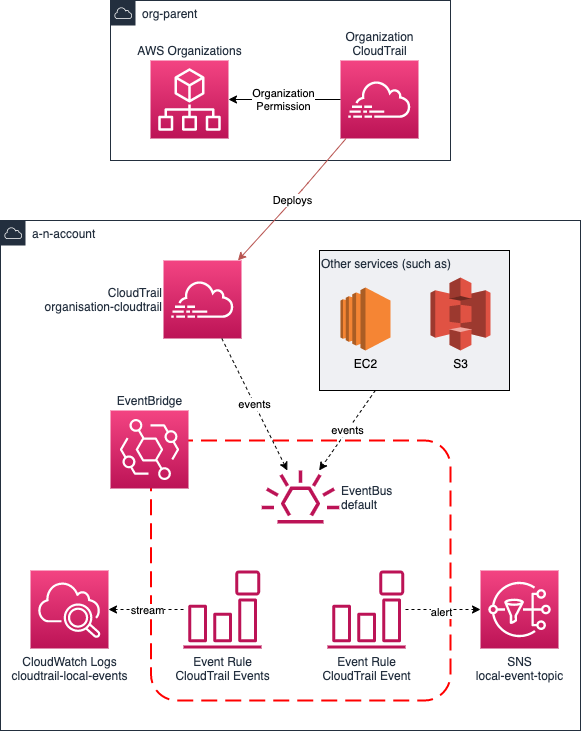

# AWS CloudTrail Alerts Module using EventBridge

This Terraform module allows users to create CloudTrail events using EventBridge, rather than CloudWatch Logs. The mechanism to create alerts from CloudWatch Logs cannot be done one you have migrated to an AWS Organization based CloudTrail.

## Design

This implementation leverages the already existing Default EventBus in each AWS account which collects data from the majority of AWS services. Rules are deployed using the EventBus as a data source, with targets of SNS topics for any alerts.



## Implementation

### Prerequisites

You can create and specify an SNS topic and an SQS queue within your own Terraform prior to using this module. If you do not, we will create one as part of the usage.

### Parameters

The following parameters are accepted by the module:

| Variable | Description | Optional | Default Value |
| --- | -------- | --- | --- |
| kms_alerts_flag | Deploy KMS alerts | Yes | False |
| login_alerts_flag | Deploy Login attempt alerts | Yes | False |
| networking_alerts_flag | Deploy networking change alerts | Yes | False |
| authorization_alerts_flag | Deploy authorization alerts | Yes | False |
| service_alerts_flag | Deploy service alerts | Yes | False |
| ec2_alerts_flag | Deploy EC2 alerts | Yes | False |
| iam_alerts_flag | Deploy IAM alerts | Yes | False |
| s3_alerts_flag | Deploy S3 alerts | Yes | False |
| rate_alerts_flag | Deploy rate alerts | Yes | False |
| sns_topic_name | Whether to deploy a unique name for the SNS topic | Yes | `cloudtrail-alerts-<accountId>-<region>` |
| sns_topic_arn | Re-use an existing SNS topic arn | Yes | null |
| sqs_queue_name | Whether to deploy a unique name for the SQS queue | Yes | `cloudtrail-alerts-dlq-<accountId>-<region>` |
| sqs_queue_arn | Re-use an existing SQS queue arn | Yes | null |

You MUST enable at least one flag for the module to work.

### Example implementation

The below implementation would deploy all alerts:

```hcl
provider "aws" {
  region = "eu-west-2"
}

provider "aws" {
  alias  = "aws_us_east_1"
  region = "us-east-1"
}

module "standard_alerts" {
  source                  = "./aws-cloudtrail-alerts-module-eb"
  
  kms_alerts_flag         = true
  networking_alerts_flag  = true
  authorization_alerts_flag = true
  service_alerts_flag = true
  ec2_alerts_flag = true
  iam_alerts_flag = true
  s3_alerts_flag = true
  rate_alerts_flag = true
}

module "login_alert" {
  providers = {
    aws = aws.aws_us_east_1
  }

  source            = "./aws-cloudtrail-alerts-module-eb"
  login_alerts_flag = true
}
```

## Alerts

### KMS Alerts

Alerts deployed as follows:

| Alert | Description |
| --- | -------- |
| kms_key_disabled | has a key been disabled |
| kms_key_changed | has a key been changed or created |

These alerts are enabled by setting the `kms_alerts_flag` to true.

### Networking Alerts

Alerts deployed as follows:

| Alert | Description |
| --- | -------- |
| security_group_changed | security group created or changed |
| nacl_changed | network access control list created or changed |
| gateway_changed | Gateways, such as NAT or IGW, created or changed |
| route_table_changed | Route tables created or changed |
| vpc_changed | VPC created or changed |

These alerts are enabled by setting the `networking_alerts_flag` to true.

### User Login Alerts

Alerts deployed as follows:

| Alert | Description |
| --- | -------- |
| iam_breakglass_login | has a user logged in with the breakglass user |

As of October 2021, there is a limitation with the default Event Bus whereby user login alerts can only be generated from us-east-1. For this reason, the login alerts module should only be deployed to us-east-1. As part of the use of this module, you should set a secondary provider in us-east-1:

```hcl
provider "aws" {
  alias  = "aws_us_east_1"
  region = "us-east-1"
}
```

Then deploy only the login_alerts to us-east-1 as follows:

```hcl
module "login_alerts" {
  providers = {
    aws = aws.aws_us_east_1
  }

  source            = "../aws-cloudtrail-alerts-module-eb"
  kms_alerts_flag   = false
  login_alerts_flag = true
}
```

You are unable to use a cross region SNS subscription so you must then subscribe to the SNS topic in us-east-1.

### Authorization Alerts

Alerts deployed as follows:

| Alert | Description |
| --- | -------- |
| access_denied | operations attempted but unauthorized |

These alerts are enabled by setting the `authorization_alerts_flag` to true.

### Service Alerts

Alerts deployed as follows:

| Alert | Description |
| --- | -------- |
| config_change | a change was made against AWS Config |
| cloudtrail_change | a change was made against AWS CloudTrail |

These alerts are enabled by setting the `service_alerts_flag` to true.

### EC2 Alerts

Alerts deployed as follows:

| Alert | Description |
| --- | -------- |
| ec2_status_change | an EC2 instance state was changed |
| ec2_large_instance | a large EC2 instance was started |

These alerts are enabled by setting the `ec2_alerts_flag` to true.

### IAM Alerts

Alerts deployed as follows:

| Alert | Description |
| --- | -------- |
| iam_policy_changes | an IAM policy change was made |
| root_account_usage | an operation was executed with the root account |

These alerts are enabled by setting the `iam_alerts_flag` to true.

### S3 Alerts

Alerts deployed as follows:

| Alert | Description |
| --- | -------- |
| s3_changes | a change was made to S3 bucket |

These alerts are enabled by setting the `s3_alerts_flag` to true.

### Rate Alerts

Alerts deployed as follows:

| Alert | Description |
| --- | -------- |
| ssm_rate_alerts | an SSM rate limit was hit |

These alerts are enabled by setting the `rate_alerts_flag` to true.

### Custom Alerts

Coming soon.
